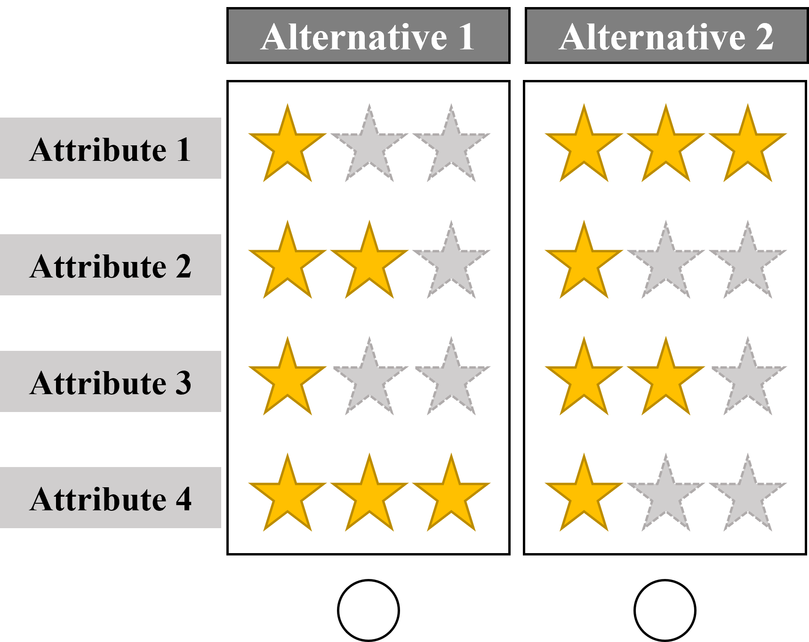
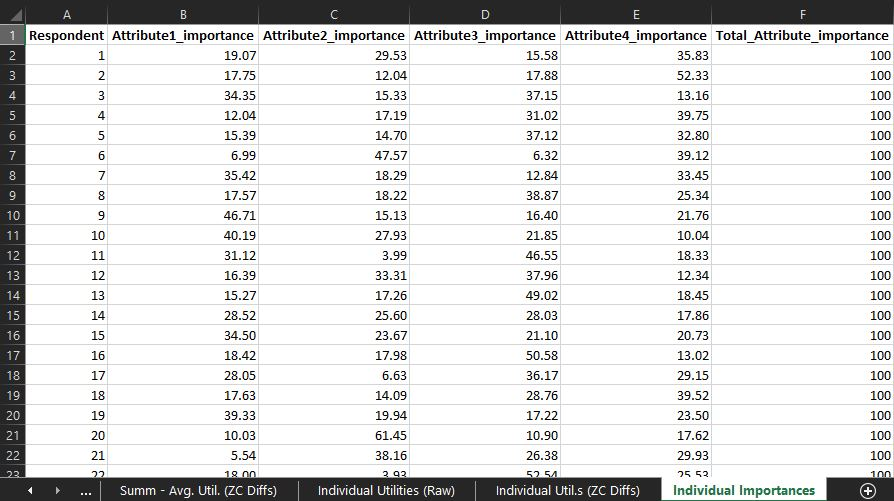

# Hierarchical Bayesian hierarchical multinomial logit analysis and report in R 
This README provides detailed instructions on how to use the provided R code for estimating a hierarchical Bayesion hierarchical multinomial logit model using choice-based conjoint data, as well as recreating a corresponding Sawtooth/Lighthouse report to summarize the results. Whenever you conduct a conjoint analysis, you are likely to run into [Lighthouse Studio by Sawtooth Software](https://sawtoothsoftware.com/). Their  software is incredibly powerful, intuitive to use, and free for students and researchers for a limited time. I developed this code to be able to extend my analyses beyond the scope offered by their software. In addition, the free access to their software via student or academic grants is timely limited. The code therefore allowed me to work independent from timely restrictions.


## Table of Contents
1. [Setup](#setup)
2. [Data Preprocessing](#data-preprocessing)
3. [Data Analysis](#data-analysis)
4. [Recreating Sawtooth/Lighthouse Report](#recreating-sawtoothlighthouse-report)
5. [Exporting Final Report](#exporting-final-report)

## 1. Setup <a name="setup"></a>

### Required Libraries
Before running the code, ensure you have the necessary R packages installed. You can install these packages using the `install.packages()` function if you haven't already.

```R
require(here)
require(tidyverse)
require(dplyr)
require(ChoiceModelR)
require(onewaytests)
require(stringr)
require(writexl)
```
### Info on the Choice-based Conjoint Experiment Design
The data is structured to capture choices made by respondents across different tasks and concepts, considering various attributes associated with those concepts. The dataset can be used for analyzing choice behavior, such as preference modeling or predicting choices based on attribute levels.
+ Respondents were presented with two options (i.e., alternatives or concept) per page (i.e., task).
+ Each alternative was described using four distinct attributes.
+ Each attribute had exactly three levels (low: ⭐☆☆, medium: ⭐⭐☆, high: ⭐⭐⭐).
+ The experiment started with a fixed design in the first task, in which the left/first alternative was described by high: ⭐⭐⭐ for each attribute.
+ The following 2-21 tasks followed a random design.

Here's an exemplary choice-based conjoint task:



### Load the Dataset
Make sure you have your choice dataset prepared in a CSV file format. The code assumes that your dataset is stored in a folder named "dataset" and the file is named "CBC_Choices.csv". You can modify the file path accordingly.

```R
# Load the dataset
data <- read.csv(here("dataset", "CBC_Choices.csv"), sep = ";") 
```

The choice-based conjoint data should look like this:

| sys_RespNum | Task | Concept | Attribute1 | Attribute2 | Attribute3 | Attribute4 | Response |
| ----------- | ---- | ------- | ---------- | ---------- | ---------- | ---------- | -------- |
| 1           | 1    | 1       | 3          | 3          | 3          | 3          | 1        |
| 1           | 1    | 2       | 2          | 1          | 2          | 1          | 0        |
| 1           | 2    | 1       | 1          | 3          | 3          | 2          | 1        |
| 1           | 2    | 2       | 3          | 1          | 1          | 3          | 0        |
| 1           | 3    | 1       | 3          | 2          | 1          | 1          | 1        |
| 1           | 3    | 2       | 2          | 3          | 2          | 2          | 0        |
| 1           | 4    | 1       | 2          | 2          | 2          | 2          | 1        |
| 1           | 4    | 2       | 1          | 3          | 2          | 3          | 0        |
 ...
| 1           | 20   | 1       | 2          | 2          | 2          | 3          | 1        |
| 1           | 20   | 2       | 2          | 1          | 1          | 1          | 0        |
| 1           | 21   | 1       | 1          | 1          | 2          | 1          | 0        |
| 1           | 21   | 2       | 3          | 1          | 3          | 3          | 1        |
| 2           | 1    | 1       | 2          | 3          | 2          | 3          | 1        |
| 2           | 1    | 2       | 1          | 1          | 1          | 3          | 0        |
| 2           | 2    | 1       | 1          | 2          | 3         

The dataset contains the following variables:
1. `sys_RespNum`: An identifier for the respondent or participant.
2. `Task`: Represents different tasks or scenarios. Note that this number starts at 1 again, once the respondent id (sys_RespNum) switches to the next person. This is important for the estimation to work later on.
3. `Concept`: Indicates different concepts or alternatives within each task.
4. `Attribute1`, `Attribute2`, `Attribute3`, `Attribute4`: Represent attributes or features associated with each concept. The values in these columns represent different levels or characteristics of the attributes.
5. `Response`: Indicates the response or choice made by the respondent. It is coded binary, with values of 0 and 1, where 1 indicates the selection of a particular concept, and 0 indicates the non-selection of that concept.

Using the first two rows as an example, we see:
+ The first row captures the first concept/alternative displayed on the left in task 1.
+ This first concept/alternative had a level of 3 (i.e., high: ⭐⭐⭐) for each of the four displayed attributes.
+ The reponse column indicates that the respondet choose this option (1 = chosen).
+ The second row captures the second concept/alternative that was displayed on the right in task 1.
+ This second concept/alternative had a level of 2 (i.e., medium: ⭐⭐☆) for attribute1 and attribute 3 and a level of 1 (i.e., low: ⭐☆☆) for attribute2 and attribute 4.
+ The reponse column indicates that the respondet did not choose this option (0 = not chosen). Note that the first row already helps us infer that the second concept/alternative was not chosen, as only one concept/alternative within a task can be chosen.

## 2. Data Preprocessing <a name="data-preprocessing"></a>

### Renaming Columns
Columns are renamed for clarity to match specific variable names. This step is necessary to ensure uniformity in the dataset.

### Creating Dummy Variables
The code creates dummy variables for the categorical attribute variables of the choice based conjoint design to prepare the data for choice modeling. It renames these dummy variables by replacing spaces with dots in column names.

Here's an example using the attribute 1:

Before:
| sys_RespNum | Task | Concept | <mark>Attribute1</mark> | Attribute2 | Attribute3 | Attribute4 | Response |
| ----------- | ---- | ------- | ---------- | ---------- | ---------- | ---------- | -------- |
| 1           | 1    | 1       | 3          | 3          | 3          | 3          | 1        |
| 1           | 1    | 2       | 2          | 1          | 2          | 1          | 0        |

After:
| sys_RespNum | Task | Concept | Attribute1<mark>_low</mark>  | Attribute1<mark>_medium</mark>  | Attribute1<mark>_high</mark>  | Attribute2 | Attribute3 | Attribute4 | Response |
| ----------- | ---- | ------- | --------------- | ----------------- | ---------------- | ---------- | ---------- | ---------- | -------- |
| 1           | 1    | 1       | 0          | 0             | 1              | 3          | 3          | 3          | 1        |
| 1           | 1    | 2       | 0          | 1             | 0              | 1          | 2          | 1          | 0        |


### Creating a Choice Variable
This is an important step for the analysis to work. A choice variable is created based on the "alt" (alternative) and "choice" columns. This variable indicates which alternative was chosen for each task.

For every task, the row containing "alt" (alternative) = 1, the "choice" columns (which was previosuly called "Response") should indicate which alternative was chosen, the "choice" column values for all other rows for this task should contain "choice" = 0

Before:
| sys_RespNum | Task | Concept | Attribute1 | Attribute2 | Attribute3 | Attribute4 | Response |
| ----------- | ---- | ------- | ---------- | ---------- | ---------- | ---------- | -------- |
 ...
| 1           | 21   | 1       | 1          | 1          | 2          | 1          | <mark>0</mark>|
| 1           | 21   | 2       | 3          | 1          | 3          | 3          | <mark>1</mark>|

After:
| sys_RespNum | Task | Concept | Attribute1 | Attribute2 | Attribute3 | Attribute4 | Choice |
| ----------- | ---- | ------- | ---------- | ---------- | ---------- | ---------- | -------- |
 ...
| 1           | 21   | 1       | 1          | 1          | 2          | 1          | <mark>2</mark>|
| 1           | 21   | 2       | 3          | 1          | 3          | 3          | <mark>0</mark>|


## 3. Data Analysis <a name="data-analysis"></a>

### Removing Reference Group Columns 
Columns ending with "medium" are removed to serve as reference groups and avoid multicollinearity. 

### Performing Choice Modeling
Choice modeling is performed using the [`choicemodelr`](https://github.com/cran/ChoiceModelR) function. The results will be saved in the "estimations" directory.
```R
# Perform choice modeling
hb.post <- choicemodelr(data = choice_data, 
                        xcoding = rep(1, 8),
                        mcmc = list(R = 20000, use = 10000),
                        options = list(save = T),
                        directory = here("estimations")
)
```

1. `data`: This argument specifies the dataset that you want to use for choice modeling. In this case, it's `choice_data`, which  contains the data on respondent choices and attributes. It is important to follow the previous steps to get the data into the specific shape needed for the function to work.

2. `xcoding`: This argument specifies the coding scheme for the model. It's a vector that controls the coding for each attribute. In this example, `rep(1, 8)` indicates that all attributes are coded with the same scheme, using **effect coding**. Effect coding is a way to represent categorical variables in regression models, and here, it's used for coding the levels of attributes.

3. `mcmc`: This argument configures the Markov Chain Monte Carlo (MCMC) settings for estimation. MCMC is a statistical method used for estimating parameters in complex models. 
   - `R`: Specifies the total number of iterations or "runs" for the MCMC algorithm. In this case, it's set to 20,000 iterations.
   - `use`: Specifies the number of iterations to use after the burn-in period. MCMC typically starts with a burn-in period where it discards the initial iterations to allow the chain to converge to the target distribution. Here, it's set to 10,000 iterations.

4. `options`: This argument allows you to specify additional options for the estimation process. 
   - `save`: A logical value (TRUE/FALSE). When set to TRUE, it indicates that the estimation results should be saved.

5. `directory`: Specifies the directory where the estimation results should be saved. In this example, it uses the `here` function to specify a directory named "estimations" as the location to save the results.


## 4. Recreating Sawtooth/Lighthouse Report <a name="recreating-sawtoothlighthouse-report"></a>

### Individual Utilities (Raw)
This section reads in raw utilities and root-likelihood (RLH) estimates and renames columns to match the input dataframe.

### Individual Importances
This section calculates attribute ranges and importances for all attributes based on raw utilities.

### Summary - Average Importances
Calculates average importances and standard deviations for each attribute.

### Individual Utilities (ZC Diffs)
Bryan Orme, CEO of Sawtooth Software, outlined the 4-step formula for calculating zero-centered differences/diffs in this [forum entry](https://community.sawtoothsoftware.com/lighthouse-studio/post/is-there-a-formula-for-calculating-the-zero-centered-diffs-pMt4EAIEEK2GA8k). 
1. Within each attribute, compute the mean utility. Within each attribute, subtract the mean utility from each utility (this zero-centers the utilities within each attribute...which often doesn't have to be done since they are often already zero-centered in their raw form).

2. Then, for each attribute compute the difference between best and worst utilities. Sum those across attributes.

3. Take 100 x #attributes and divide it by the sum achieved in step 2. This is a single multiplier that you use in step 4.

4. Multiply all utilities from step 1 by the multiplier. Now, the average difference between best and worst utilities per attribute is 100 utility points.

My code follows these four steps to calculates zero-centered diffs from raw betas that we estimated in [Data Analysis](#data-analysis) based on dummy coding.

### Summary - Average Utilities (Zero-Centered Diffs)
Calculates the mean and standard deviation of utilities for each attribute level.

## 5. Exporting Final Report <a name="exporting-final-report"></a>

The final report is exported as an Excel file named "HB_report.xlsx". It includes sheets for the following:
- `Summ - Average Importances`: Summary of average importances.<br>


- `Summ - Avg. Util. (ZC Diffs)`: Summary of average utilities with Zero-Centered Diffs.<br>


- `Individual Utilities (Raw)`: Individual-level utilities.<br>


- `Individual Util.s (ZC Diffs)`: Individual-level utilities with Zero-Centered Diffs.<br>


- `Individual Importances`: Individual-level importances.<br>
